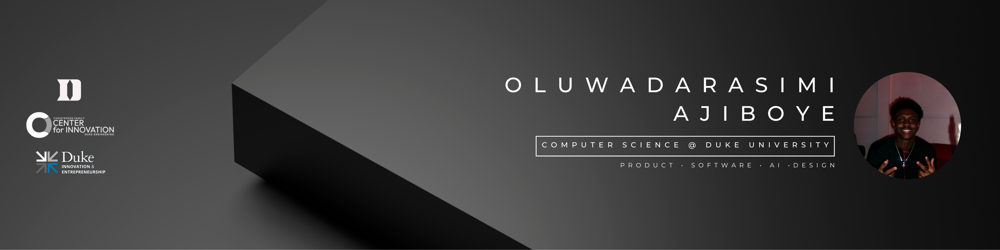

<link href="https://fonts.googleapis.com/css2?family=Bebas+Neue&display=swap" rel="stylesheet">

  

<h1 align="left">Hello there 👋, I'm Oluwadarasimi (Dara) Ajiboye</h1>

<!-- Social badges -->

  <a href="mailto:ajiboyedara2@gmail.com" style="display: inline-block; background-color: #303030; color: #ffffff; text-decoration: none; padding: 24px 36px; border-radius: 3px; font-size: 22px; font-weight: 600; margin-right: 15px; vertical-align: middle; line-height: 1.5; transition: opacity 0.2s; font-family: 'Bebas Neue', sans-serif;">
    
    Email
  </a>
  <a href="https://github.com/AjiboyeDara/AjiboyeDara" style="display: inline-block; background-color: #303030; color: #ffffff; text-decoration: none; padding: 24px 36px; border-radius: 3px; font-size: 22px; font-weight: 600; margin-right: 15px; vertical-align: middle; line-height: 1.5; transition: opacity 0.2s; font-family: 'Bebas Neue', sans-serif;">
    
    GitHub
  </a>
  <a href="https://www.linkedin.com/in/oluwadarasimi-ajiboye/" style="display: inline-block; background-color: #303030; color: #ffffff; text-decoration: none; padding: 24px 36px; border-radius: 3px; font-size: 22px; font-weight: 600; margin-right: 15px; vertical-align: middle; line-height: 1.5; transition: opacity 0.2s; font-family: 'Bebas Neue', sans-serif;">
    
    LinkedIn
  </a>
  <a href="https://instagram.com/dara.ajiboye" style="display: inline-block; background-color: #303030; color: #ffffff; text-decoration: none; padding: 24px 36px; border-radius: 3px; font-size: 22px; font-weight: 600; margin-right: 15px; vertical-align: middle; line-height: 1.5; transition: opacity 0.2s; font-family: 'Bebas Neue', sans-serif;">
    
    Instagram
  </a>

---
## 👤 About Me

My name is Oluwadarasimi Ajiboye, but I go by Dara. I'm a Computer Science student at Duke University, also pursuing a certificate in Innovation and Entrepreneurship. I was born in Lagos, Nigeria, and moved to the U.S. at nine, an experience that shaped my curiosity and adaptability. I'm passionate about the intersection of product development and business, building solutions that make a real impact. At my core, I'd describe myself as energetic, communicative, and growth-driven. I thrive in collaborative environments, love learning from others, and I'm eager to apply my technical skills and product mindset to create meaningful, real-world solutions.

---

## 🎓 Education

**Duke University** — Durham, NC  
**B.S. Computer Science**, Innovation & Entrepreneurship Certificate  
Expected Graduation: **May 2028** | **GPA: 4.0**

- QuestBridge College Match Scholar  
- U.S. Marine Corps Scholastic Excellence Award  
- Fox Scholarship Recipient  

**Relevant Coursework:**  
Data Structures & Algorithms, Product Management I & II, Calculus I–II, Linear Algebra

---

## 🧠 Technical Skills

**Languages:**  
Java · Python · JavaScript · HTML · CSS · C++ · GDScript  

**Frameworks & Tools:**  
React · React Native · Node.js · Figma · Godot  
AutoCAD · Autodesk Inventor  

**Languages (Human):**  
Yoruba (Fluent) · Pidgin (Fluent)

---

  

---

## 🌱 I'm currently learning

  
  

---

## 🧭 Leadership & Development

- **Career Prep Fellow (Software Engineering)** — Management Leadership for Tomorrow  
- **SEO EDGE Participant** — Sponsors for Educational Opportunity  
- **Vice President** — Duke East Campus Council (Managed $96,750 budget)  
- **Finance Chair** — National Society of Black Engineers (NSBE)  

Affiliations:  
ColorStack · Duke Innovation & Entrepreneurship · DukeAFRICA · SPIRE Fellows

## 📫 Contact

- Email: **ajiboyedara2@gmail.com**  
- LinkedIn: https://www.linkedin.com/in/oluwadarasimi-ajiboye/
